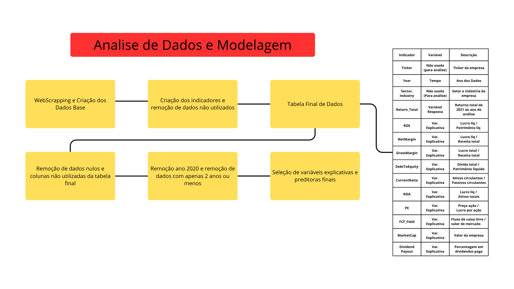

# 📈 Projeto Final de Ciência de Dados: Previsão de Retorno de Ações

## 0. Participantes do Grupo

- **João Paulo Bussi**
- **Ashton Apebio Mergulhao Segnibo**
- **Antonio Augusto Nunes de Souza**
- **Professor:** Francisco Rodrigues

***

## 1. Tema e Objetivos do Projeto

O tema central é a **Previsão de Retorno Total Anual (`Return_Total`) de Ações** utilizando *indicadores financeiros passados* e **Modelos de Regressão Ensemble** (Random Forest, Gradient Boosting e Bagging).

### Objetivo Principal de Modelagem
Identificar o modelo de regressão que melhor se generaliza, minimizando o **RMSE** (Root Mean Squared Error) e maximizando o **$R^2$** (Coeficiente de Determinação) no conjunto de teste, ao prever o retorno no ano $Y$ com base nos anos $Y-2$ e $Y-1$.

### Objetivo de Negócio
O projeto visa descobrir padrões de sucesso no **curto/médio prazo (4-5 anos)**, avaliando quais indicadores financeiros anuais, advindos do **web scraping** de dados, demonstram maior correlação com retornos positivos futuros. O resultado final é a identificação de ações com maior propensão a gerar retornos superiores no ano seguinte à observação dos *lags*.

***

## 2. Base de Dados

A base de dados foi construída através de *web scraping* da plataforma **Yahoo Finance** utilizando a biblioteca `YFinance`, abrangendo dados financeiros dos últimos anos disponíveis.

| Característica | Detalhes |
| :--- | :--- |
| **Arquivo de Entrada** | `yfinanceFinalIndicators.csv` |
| **Geração** | Web Scraping (Yahoo Finance) |
| **Natureza** | Séries temporais financeiras anuais de empresas de capital aberto. |
| **Variável Resposta (y)** | `Return_Total` (Retorno total anual, incluindo variação de preço e dividendos). |
| **Pré-processamento** | Remoção de colunas com alta cardinalidade (`date`, `DividendPayout`). Filtragem rigorosa para manter apenas *tickers* com **pelo menos 3 anos de dados completos e consecutivos** ($Y-2, Y-1, Y$). |
| **Engenharia de Features** | O modelo usa *lags* temporais, onde as *features* do ano $Y-2$ e do ano $Y-1$ são concatenadas para prever o `Return_Total` do ano $Y$. |

***

## 3. Fluxograma da Análise de Dados

A análise seguiu um pipeline de *Machine Learning* robusto, documentado abaixo:

***

## 4. Desafios Enfrentados

1.  **Baixa Preditibilidade Inerente:** A maior dificuldade em finanças é o **alto ruído, aleatoriedade e o baixo volume de dados** (apenas nos últimos 4 anos). O baixo **$R^2$** e alto **RMSE** obtidos são resultados esperados, pois a maior parte da variância do `Return_Total` é explicada por fatores exógenos (notícias de mercado, mudanças regulatórias, macroeconomia) não capturados nos indicadores anuais.
2.  **Tratamento de Dados Categóricos:** O **One-Hot Encoding** nas variáveis `Sector` e `Industry` resultou em um significativo aumento na dimensionalidade de $X$, desafiando os modelos *ensemble* a gerenciarem um número elevado de *features* esparsas de forma eficiente.
3.  **Identificação de Infinitos:** Foi necessário um passo de limpeza rigorosa para identificar e remover linhas com valores infinitos (`Inf`), que surgem de forma intrínseca em indicadores financeiros (ex: divisão por zero ou quase-zero em proporções como *Debt-to-Equity* ou *P/E*).

***

## 5. Resultados e Conclusões Chave

A avaliação no conjunto de teste confirmou que o **Gradient Boosting Regressor (GBR)**, em sua configuração otimizada, apresentou o melhor desempenho.

***

## 6. Motivação da Escolha do Tema

A escolha do tema foi impulsionada pela **intersecção da Ciência de Dados com a análise financeira quantitativa**, um campo de alta demanda e complexidade. O projeto proporcionou:

* **Experiência Completa:** Desde a coleta de dados (Web Scraping/YFinance) até a modelagem avançada (GridSearchCV, Regressão Ensemble).
* **Domínio de Séries Temporais:** Aplicação prática da Engenharia de Features Temporal com *lags* ($Y-2 \rightarrow Y-1 \rightarrow Y$).
* **Análise Crítica:** A possibilidade de medir objetivamente a dificuldade de previsão do mercado, fornecendo uma conclusão baseada em dados sobre a real utilidade e limitações dos indicadores anuais.